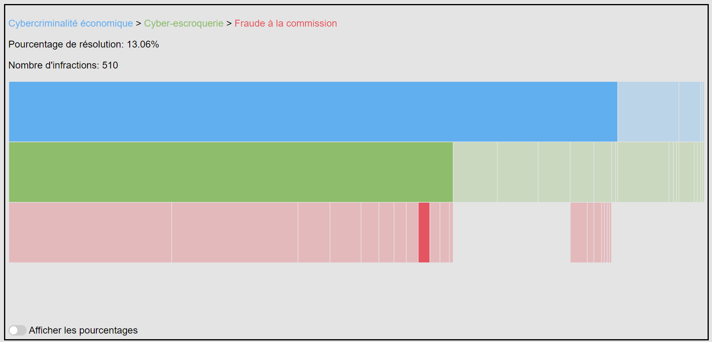

# Visualisation de la criminalité numérique de 2022 en Suisse

## Description

La visualisation prend la forme d'un "sequences icicle" interactif qui, lorsque la souris est passée sur un rectangle, affiche son "chemin", son nom, son taux de résolution et le nombre d'infractions. De plus, via un bouton il est possible de basculer sur une seconde vue qui affiche directement le taux de résolution de manière visuelle de l'ensemble de la visualisation. Finalement, nous avons choisi de présenter le résultat dans le même style qu'un article de presse en ligne. Le but est de réaliser quels crimes sont rapportés aux autorités compétentes et combien sont élucidés.

Voici à quoi ressemble la visualisation lorsque l'on ouvre la page.

Premier mode où l'on constate la répartition des infractions rapportées.

Seconde mode où les rectangles sont plus ou moins remplis en fonction du taux de résolution.

## Outils employés

Nous avons employé la bibliothèque [d3.js](https://d3js.org/) pour créer notre visualisation.

## Source des données

Les données proviennent du site de l'Office fédéral de la statistique.

Vous pouvez retrouver les données brutes au format Excel via ce [lien](https://www.bfs.admin.ch/bfs/fr/home/statistiques/criminalite-droit-penal/police/criminalite-numerique.assetdetail.24368414.html).

Nous avons décidé de nous concentrer sur l'année 2022, mais la base de données contient également les statistiques des années 2020 et 2021.

Dans un premier temps, nous les avons retravailler dans Excel puis exporter au format csv. Afin de faciliter la suite, le csv suit la structure suivante : <code>nom</code> où l'on a séparé les titres, sous-titres et sous-sous-titres à l'aide d'un <code>/</code>, viennent ensuite le <code>nbInfractions</code> et enfin, le <code>nbResolutions</code>.

## Autres références

Le code permettant de réaliser ce type de visualisation a été inspiré du travail de Kerry Rodden, disponible [ici](https://observablehq.com/@kerryrodden/sequences-icicle).

Le code pour le bouton a été repris de ce [tutoriel](https://www.w3schools.com/howto/howto_css_switch.asp).

## Contexte

Cette visualisation a été réalisée dans le cadre du cours "Visualisation de données" de M. Isaac Pante. Le public visé est le suivant : les personnes étudiant le domaine, tels que, notamment, les policiers, avocats, juges, journalistes, etc. ou plus largement toute personne simplement curieuse d’en apprendre davantage sur le sujet.

## Auteurs

La visualisation a été réalisée par Julie Jeanneret et Martin Ruffieux, étudiants du Master DCS.